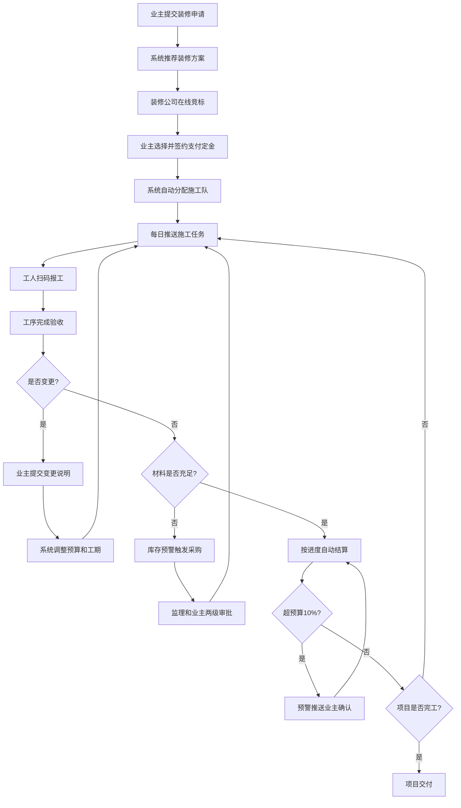

## 1. 产品概述

智慧家装全流程管理平台整合业主装修申请、方案推荐、在线竞标、施工调度、材料管控与费用结算全链路，实现家装业务数字化、智能化管理。

- 主要目的：打通家装行业从需求到交付的全流程，提升运营效率，降低管理成本，提高业主满意度
- 目标用户：业主、装修公司、施工队、项目监理、平台管理员
- 市场价值：解决家装行业信息不透明、流程混乱、成本失控等痛点

## 2. 核心功能

### 2.1 用户角色

| 角色 | 注册方式 | 核心权限 |
|------|----------|----------|
| 业主 | 手机号注册 | 提交装修申请、查看方案、选择装修公司、在线签约、验收评分、查看费用、申请变更 |
| 施工队 | 平台审核入驻 | 查看分配任务、扫码报工、查看绩效 |
| 项目监理 | 平台审核入驻 | 管理所负责项目、审批材料采购、监督施工质量、验收工序 |
| 管理员 | 平台分配 | 全局数据管理、用户管理、规则配置、导出报告 |

### 2.2 功能模块

1. **首页大屏**：项目进度看板、材料库存监控、施工队员绩效、业主满意度统计、筛选与导出
2. **装修申请**：业主提交房屋信息与预算、系统自动推荐方案及报价
3. **在线竞标**：装修公司投标、业主对比选择、在线签约与定金支付
4. **施工调度**：自动分配施工队、每日任务推送、扫码报工、工序验收
5. **材料管控**：材料清单自动生成、库存预警、采购申请、两级审批
6. **费用结算**：按进度自动结算、预算超支预警、变更费用调整
7. **变更管理**：业主提交变更说明、自动调整预算与工期、审批流程
8. **权限管理**：四级角色权限控制、数据隔离

### 2.3 页面详情

| 页面名称 | 模块名称 | 功能描述 |
|-----------|-------------|---------------------|
| 首页大屏 | 项目进度总览 | 实时展示各项目进度、状态统计、甘特图视图 |
| 首页大屏 | 材料库存看板 | 库存数量、安全线预警、出入库记录 |
| 首页大屏 | 施工绩效排名 | 工人完工率、评分、效率排行榜 |
| 首页大屏 | 满意度统计 | 业主评分分布、趋势图、评论展示 |
| 首页大屏 | 筛选导出 | 按小区/户型/日期筛选、一键导出月度报告 |
| 装修申请 | 房屋信息录入 | 小区、户型、面积、楼层、装修风格选择 |
| 装修申请 | 方案推荐 | 根据面积和风格自动推荐3套方案及报价对比 |
| 在线竞标 | 竞标大厅 | 展示竞标项目、装修公司报价与方案 |
| 在线竞标 | 签约管理 | 电子合同、定金支付、档期锁定 |
| 施工调度 | 任务看板 | 按天展示施工任务、工人分配、进度状态 |
| 施工调度 | 扫码报工 | 任务二维码、工人扫码确认完工 |
| 施工调度 | 工序验收 | 业主验收评分、48小时自动通过机制 |
| 材料管控 | 材料清单 | 按工序生成材料清单、用量计算 |
| 材料管控 | 库存管理 | 实时库存、安全线预警、出入库记录 |
| 材料管控 | 采购审批 | 采购申请、监理审批、业主确认 |
| 费用结算 | 账单明细 | 按进度生成账单、收支明细、发票管理 |
| 费用结算 | 预算预警 | 超10%自动预警、业主确认机制 |
| 变更管理 | 变更申请 | 业主上传变更说明、附件、调整项选择 |
| 变更管理 | 影响评估 | 自动计算预算变化、工期调整 |
| 权限管理 | 用户管理 | 用户列表、角色分配、账号状态 |
| 权限管理 | 规则配置 | 预警阈值、审批流程、自动规则设置 |

## 3. 核心流程

业主提交房屋信息和预算 → 系统根据面积和风格自动推荐装修方案及报价 → 装修公司在线竞标 → 业主选中后在线签约并支付定金，锁定施工档期 → 施工阶段系统根据工种和排期自动分配施工队 → 每日生成任务推送到工人端 → 工人完成扫码报工 → 每道工序完成后业主在线验收评分（超48小时未验收自动默认通过） → 材料清单根据工序自动生成 → 库存低于安全线自动预警并触发采购 → 经项目监理和业主两级审批 → 业主要求变更需上传说明 → 系统自动调整预算并重新计算工期 → 费用按进度自动结算（超出预算10%自动预警并推送业主确认） → 项目完工交付

## 4. 用户界面设计

### 4.1 设计风格
- **主色调**：深青色(#0F766E)作为主色，代表专业与信任；暖橙色(#F97316)作为强调色，代表活力与警示
- **辅助色**：中性灰色系(#1E293B, #64748B, #CBD5E1)用于文字和边框
- **按钮风格**：圆角设计(8px)，主按钮渐变填充，悬停时有微上浮和阴影增强效果
- **字体**：Noto Sans SC（中文显示）+ Geist Mono（数据/数字展示），标题采用中等字重，正文常规字重
- **布局风格**：卡片式布局，顶部导航+左侧菜单的经典后台架构，信息密度适中，留白充足
- **图标风格**：Lucide图标库，线性风格，统一24px尺寸

### 4.2 页面设计概述

| 页面名称 | 模块名称 | UI元素 |
|-----------|-------------|-------------|
| 首页大屏 | 项目进度总览 | 渐变色进度条、状态标签、数据卡片带微动画、数字滚动效果 |
| 首页大屏 | 材料库存看板 | 环形进度图、预警红标闪烁动画、库存趋势面积图 |
| 首页大屏 | 施工绩效排名 | 排名奖牌样式(金/银/铜)、进度条对比、头像环绕 |
| 首页大屏 | 满意度统计 | 评分星星动画、分布柱状图、评论卡片横向滚动 |
| 首页大屏 | 筛选导出 | 下拉筛选器组、导出按钮带下载图标、日期范围选择器 |
| 装修申请 | 房屋信息录入 | 分步表单引导、卡片式选项、实时预览效果 |
| 装修申请 | 方案推荐 | 三列方案对比卡片、价格突出显示、勾选交互 |
| 在线竞标 | 竞标大厅 | 竞标倒计时动画、公司Logo展示、报价横向对比条 |
| 施工调度 | 任务看板 | 时间轴布局、任务拖拽状态、扫码弹窗带放大效果 |
| 材料管控 | 采购审批 | 审批流程节点图、两级审批按钮状态联动 |
| 费用结算 | 预算预警 | 预警弹窗渐变边框、数字高亮、确认/拒绝按钮组 |

### 4.3 响应式
- 设计方式：桌面端优先(1440px基准)，适配1920px和1366px
- 首页大屏：响应式网格布局，列数随屏幕宽度自动调整(4列→3列→2列)
- 表单页面：保持单列或双列布局，输入框最小宽度不低于280px
- 移动端：表格横向滚动，侧边栏折叠为抽屉模式

### 4.4 动效设计
- 页面加载：卡片依次渐入，间隔80ms
- 数据刷新：数字平滑过渡动画(10秒刷新周期)
- 按钮交互：悬停时背景色渐变+轻微上浮(translateY(-1px))+阴影增强
- 状态变更：颜色过渡动画(300ms)，状态标签弹跳效果
- 预警提示：脉冲闪烁动画，吸引注意力
