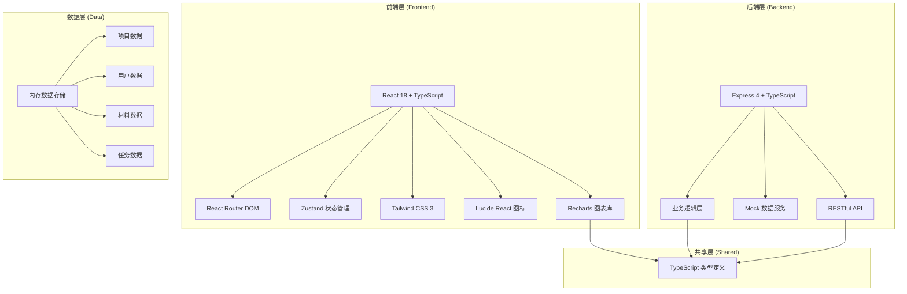
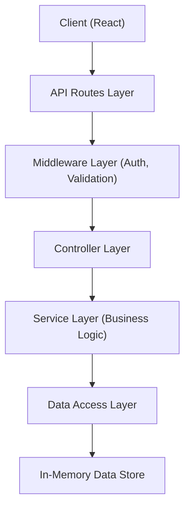
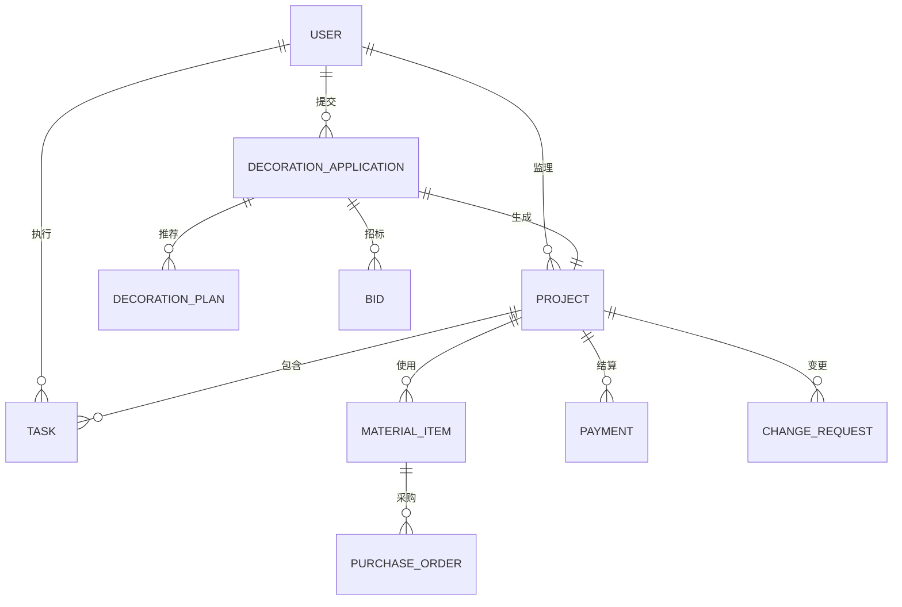

## 1. 架构设计



## 2. 技术描述

- **前端**：React@18 + TypeScript + Vite + TailwindCSS@3 + Zustand + React Router DOM@6 + Lucide React + Recharts
- **初始化工具**：vite-init (react-express-ts模板)
- **后端**：Express@4 + TypeScript
- **数据库**：内存Mock数据（使用TypeScript数据结构模拟，便于演示）
- **构建工具**：Vite@5

## 3. 路由定义

| 路由 | 页面 | 权限角色 | 用途 |
|-------|------|----------|------|
| / | 首页大屏 | 管理员/监理 | 数据看板、项目总览、筛选导出 |
| /login | 登录页 | 公开 | 用户登录、角色选择 |
| /applications | 装修申请列表 | 管理员/监理/业主 | 查看申请列表 |
| /applications/new | 新建装修申请 | 业主 | 提交房屋信息和预算 |
| /applications/:id | 申请详情 | 管理员/监理/业主 | 查看方案推荐、竞标状态 |
| /bidding | 竞标大厅 | 管理员/监理/装修公司 | 查看竞标项目、投标 |
| /bidding/:id | 竞标详情 | 管理员/监理/装修公司/业主 | 竞标对比、选择公司、签约 |
| /projects | 项目列表 | 管理员/监理/业主 | 所有项目管理 |
| /projects/:id | 项目详情 | 管理员/监理/业主 | 项目进度、任务、材料、费用 |
| /tasks | 施工任务 | 管理员/监理/施工队 | 任务看板、扫码报工 |
| /materials | 材料管理 | 管理员/监理 | 库存、清单、采购审批 |
| /materials/purchase | 采购审批 | 管理员/监理/业主 | 两级审批流程 |
| /finance | 费用结算 | 管理员/业主 | 账单明细、预算预警 |
| /changes | 变更管理 | 管理员/监理/业主 | 变更申请、影响评估 |
| /users | 用户管理 | 管理员 | 用户列表、角色分配 |
| /settings | 规则配置 | 管理员 | 预警阈值、审批流程设置 |

## 4. API 定义

### 4.1 类型定义

```typescript
// 共享类型定义
export type UserRole = 'owner' | 'worker' | 'supervisor' | 'admin';

export interface User {
  id: string;
  name: string;
  phone: string;
  role: UserRole;
  avatar?: string;
  status: 'active' | 'inactive';
  createdAt: string;
}

export type ProjectStatus = 'pending' | 'bidding' | 'signed' | 'constructing' | 'accepting' | 'completed';
export type TaskStatus = 'pending' | 'in_progress' | 'completed' | 'accepted';
export type MaterialStatus = 'normal' | 'warning' | 'shortage';
export type PurchaseStatus = 'pending' | 'supervisor_approved' | 'owner_approved' | 'rejected' | 'completed';

export interface HouseInfo {
  community: string;
  houseType: string;
  area: number;
  floor: number;
  totalFloors: number;
  style: string;
}

export interface DecorationApplication {
  id: string;
  ownerId: string;
  ownerName: string;
  houseInfo: HouseInfo;
  budget: number;
  status: ProjectStatus;
  recommendedPlans: DecorationPlan[];
  createdAt: string;
}

export interface DecorationPlan {
  id: string;
  name: string;
  description: string;
  style: string;
  basePrice: number;
  items: PlanItem[];
}

export interface PlanItem {
  name: string;
  quantity: number;
  unit: string;
  price: number;
}

export interface Bid {
  id: string;
  applicationId: string;
  companyId: string;
  companyName: string;
  companyLogo?: string;
  price: number;
  duration: number;
  description: string;
  status: 'pending' | 'selected' | 'rejected';
  createdAt: string;
}

export interface Project {
  id: string;
  applicationId: string;
  ownerId: string;
  ownerName: string;
  companyId: string;
  companyName: string;
  houseInfo: HouseInfo;
  totalBudget: number;
  usedBudget: number;
  status: ProjectStatus;
  progress: number;
  startDate: string;
  estimatedEndDate: string;
  supervisorId?: string;
  tasks: Task[];
  materials: MaterialItem[];
  createdAt: string;
}

export interface Task {
  id: string;
  projectId: string;
  name: string;
  type: string;
  assignedWorkerId?: string;
  assignedWorkerName?: string;
  status: TaskStatus;
  plannedDate: string;
  completedDate?: string;
  acceptedDate?: string;
  score?: number;
  comment?: string;
  qrCode: string;
}

export interface MaterialItem {
  id: string;
  projectId: string;
  name: string;
  specification: string;
  unit: string;
  requiredQuantity: number;
  currentStock: number;
  safeStock: number;
  unitPrice: number;
  status: MaterialStatus;
  purchaseOrders: PurchaseOrder[];
}

export interface PurchaseOrder {
  id: string;
  materialId: string;
  materialName: string;
  quantity: number;
  totalPrice: number;
  status: PurchaseStatus;
  applicantId: string;
  supervisorApprovalId?: string;
  ownerApprovalId?: string;
  rejectionReason?: string;
  createdAt: string;
}

export interface Payment {
  id: string;
  projectId: string;
  type: 'deposit' | 'progress' | 'final';
  amount: number;
  stage: string;
  status: 'pending' | 'paid' | 'overdue';
  dueDate: string;
  paidDate?: string;
  description: string;
}

export interface ChangeRequest {
  id: string;
  projectId: string;
  ownerId: string;
  title: string;
  description: string;
  attachments?: string[];
  budgetImpact: number;
  durationImpact: number;
  status: 'pending' | 'approved' | 'rejected';
  createdAt: string;
}
```

### 4.2 API 端点

| 方法 | 路径 | 描述 |
|------|------|------|
| GET | /api/auth/login | 用户登录 |
| GET | /api/auth/current | 获取当前用户 |
| GET | /api/users | 获取用户列表（管理员） |
| POST | /api/users | 创建用户（管理员） |
| PUT | /api/users/:id | 更新用户（管理员） |
| GET | /api/dashboard/summary | 获取首页大屏数据 |
| GET | /api/applications | 获取装修申请列表 |
| POST | /api/applications | 创建装修申请 |
| GET | /api/applications/:id | 获取申请详情及推荐方案 |
| GET | /api/bids?applicationId= | 获取竞标列表 |
| POST | /api/bids | 创建竞标 |
| PUT | /api/bids/:id/select | 选择中标公司 |
| GET | /api/projects | 获取项目列表 |
| GET | /api/projects/:id | 获取项目详情 |
| GET | /api/projects/:id/tasks | 获取项目任务 |
| PUT | /api/tasks/:id/report | 扫码报工 |
| PUT | /api/tasks/:id/accept | 验收任务 |
| GET | /api/materials | 获取材料列表 |
| GET | /api/materials/purchase-orders | 获取采购单列表 |
| POST | /api/materials/purchase-orders | 创建采购申请 |
| PUT | /api/materials/purchase-orders/:id/approve | 审批采购单 |
| GET | /api/finance/payments | 获取付款列表 |
| POST | /api/finance/payments/:id/confirm | 确认付款 |
| GET | /api/changes | 获取变更列表 |
| POST | /api/changes | 创建变更申请 |
| PUT | /api/changes/:id/approve | 审批变更 |
| GET | /api/settings | 获取系统配置 |
| PUT | /api/settings | 更新系统配置 |
| GET | /api/reports/monthly?month= | 导出月度报告数据 |

## 5. 服务器架构图



## 6. 数据模型

### 6.1 ER图



### 6.2 数据初始化说明

系统启动时自动注入以下Mock数据：
- 4个用户（各角色一个）：业主、施工队长、项目监理、管理员
- 6个装修申请（不同小区、户型、面积）
- 12个竞标记录
- 6个活跃项目（不同施工阶段）
- 30+个施工任务
- 20+种材料及其库存数据
- 8个采购审批单
- 15+条付款记录
- 5个变更申请
